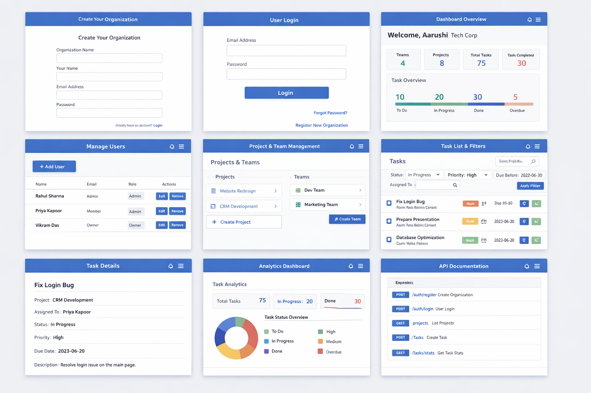

# Team Task Manager API

A RESTful backend API for a Team Project and Task Management System built using Node.js, Express, and MongoDB.

This system allows organizations to manage teams, projects, and tasks with user roles, task tracking, and analytics.

---
### All Screens

## Features

- Organization registration
- User authentication
- User management
- Project management
- Task creation and assignment
- Task filtering (status, priority, due date)
- Analytics dashboard
- Role-based user system
- RESTful API architecture

---

## Tech Stack

Backend
- Node.js
- Express.js

Database
- MongoDB
- Mongoose

Environment
- dotenv

---

## Project Structure
project
│
├── controllers
│ ├── projectControllers.js
│ ├── taskControllers.js
│ └── userControllers.js
│
├── models
│ ├── project.js
│ ├── task.js
│ └── user.js
│
├── routes
│ ├── projectRoutes.js
│ ├── taskRoutes.js
│ └── userRoutes.js
│
├── server.js
├── .env
├── package.json
